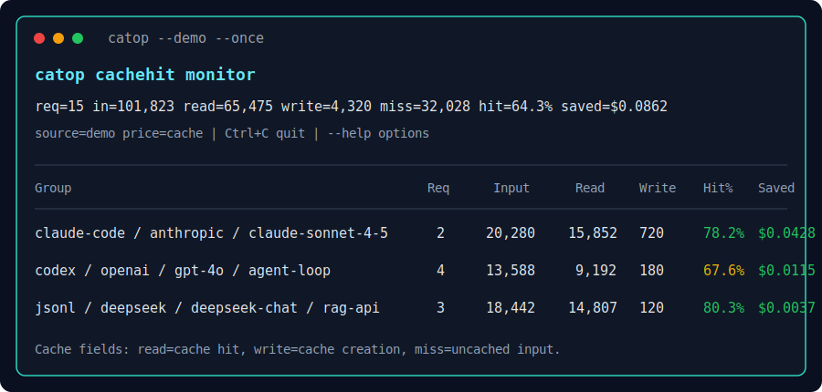
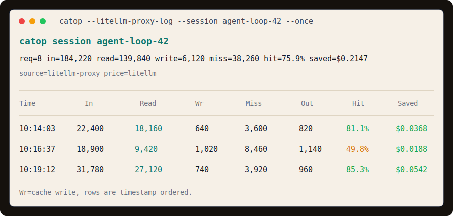
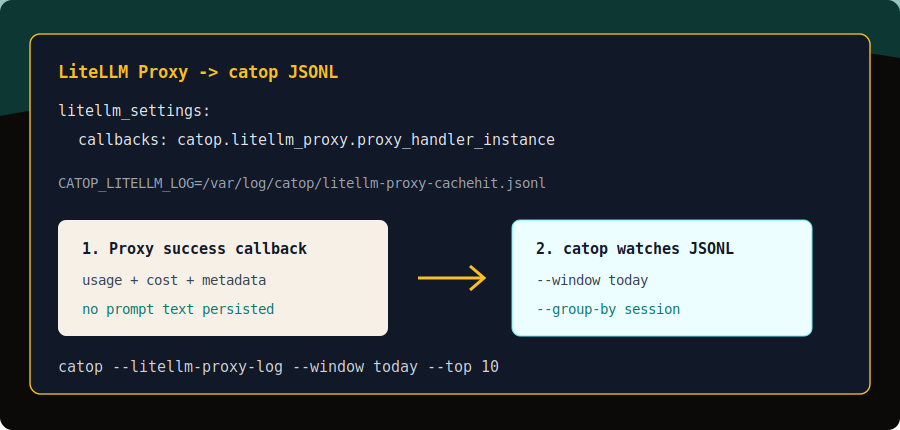
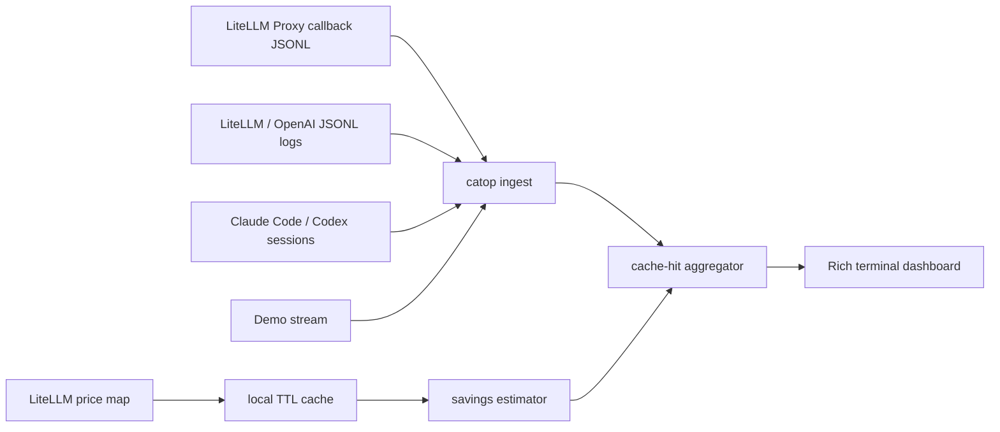

<div align="center">
  <h1>catop</h1>
  <p><strong>A top-like terminal monitor for LLM cache hits, cached tokens, and dollars saved.</strong></p>
  <p><strong>只做一件事：</strong>监视和统计 LLM prompt cache hit。</p>
  <p>
    <a href="https://harzva.github.io/catop-cachehit/">Website</a>
    ·
    <a href="#quick-start">Quick Start</a>
    ·
    <a href="#supported-inputs">Supported Inputs</a>
    ·
    <a href="#roadmap">Roadmap</a>
    ·
    <a href="https://github.com/Harzva/catop-cachehit/actions">Actions</a>
  </p>
  <p>
    <a href="https://github.com/Harzva/catop-cachehit/actions/workflows/ci.yml">
      
    </a>
    
    
    
    
  </p>
</div>

<p align="center">
  
</p>

<p align="center">
  
  
</p>

## What It Watches

`catop` is intentionally narrow. It does not try to become a full observability
platform. It watches the prompt-cache economics that matter when agents, RAG
systems, coding loops, and eval runners make repeated LLM calls.

| Signal | Meaning |
| --- | --- |
| Cache hit rate | How much of your input token traffic was served from prompt cache |
| Cache read tokens | Input tokens that used provider-side prompt caching |
| Cache write tokens | Input tokens that created or refreshed cache entries |
| Miss tokens | Input tokens billed as normal non-cached input |
| Saved USD | Estimated savings from cached input token pricing |
| Grouping | Agent, provider, model, and project/team attribution |

Current dashboard fields:

```text
req, input, cache read, cache write, miss, output, reasoning, hit%, estimated cost, observed cost, saved USD
```

## Quick Start

Run the demo stream:

```bash
python -m pip install -e .
catop --demo
```

Render one snapshot and exit:

```bash
catop --demo --once --top 5
```

Scan local coding-agent sessions:

```bash
catop --agent claude-code --once
catop --agent codex --once
catop --scan-agents --once
```

Watch LiteLLM Proxy cache traffic and drill into one session:

```bash
catop --litellm-proxy-log --window today
catop --litellm-proxy-log --group-by session
catop --litellm-proxy-log --session agent-loop-42 --once
```

Use it after publishing to GitHub:

```bash
python -m pip install "catop @ git+https://github.com/Harzva/catop-cachehit.git"
catop --demo --once
```

## Supported Inputs

| Source | Status | Default location / input |
| --- | --- | --- |
| LiteLLM Proxy callback | Supported | `catop.litellm_proxy.proxy_handler_instance` |
| LiteLLM/OpenAI JSONL | Supported | `catop --file logs.jsonl` or `catop --stdin` |
| Claude Code | Initial support | `~/.claude/projects/**/*.jsonl`, `~/.claude/transcripts/**/*.jsonl` |
| Codex CLI | Initial support | `$CODEX_HOME/sessions/**/*.jsonl` or `~/.codex/sessions/**/*.jsonl` |
| Demo mode | Supported | `catop --demo` |

Agent scanning is deliberately conservative: `catop` only counts records that
contain real token usage metadata. It does not estimate missing cache data.

## LiteLLM Proxy Callback

The first real Proxy integration uses LiteLLM's callback interface. It appends
successful request usage to JSONL without storing prompt or response text.

```yaml
litellm_settings:
  callbacks: catop.litellm_proxy.proxy_handler_instance
```

```bash
export CATOP_LITELLM_LOG="$HOME/.local/state/catop/litellm-proxy-cachehit.jsonl"
litellm --config config.yaml --debug
catop --litellm-proxy-log --window today
```

Full setup: [docs/LITELLM-PROXY.md](docs/LITELLM-PROXY.md).

## LiteLLM JSONL Input

`catop` already accepts OpenAI/LiteLLM-style JSONL records. Each line is one
request log object.

```bash
catop --file examples/litellm-cachehit.jsonl --once
```

Pipe a finite JSONL log:

```bash
cat ./litellm-requests.jsonl | catop --stdin --once
```

Example record:

```json
{
  "model": "gpt-4o",
  "litellm_provider": "openai",
  "metadata": { "project": "agent-loop" },
  "usage": {
    "prompt_tokens": 1000,
    "completion_tokens": 120,
    "prompt_tokens_details": { "cached_tokens": 400 }
  },
  "response_cost": 0.002
}
```

`catop` also recognizes common cache fields such as `cache_read_input_tokens`,
`cached_tokens`, `cache_hit_tokens`, `cache_creation_input_tokens`,
`cacheReads`, `cacheWrites`, and OpenTelemetry-style `gen_ai.usage.*`
attributes.

## Provider Coverage

`catop` can parse any provider/model name present in JSONL or agent logs. Cost
and savings estimates require a price entry. The current pricing path is:

1. LiteLLM model price map, cached locally.
2. Embedded fallback prices for common demo models.
3. Zero-dollar estimate when pricing is unknown.

| Provider family | Pricing status | Notes |
| --- | --- | --- |
| OpenAI / Codex | LiteLLM + fallback for common models | Cache read pricing supported when present |
| Anthropic / Claude | LiteLLM + fallback for common models | Cache read and cache creation pricing supported |
| DeepSeek | LiteLLM + fallback for common models | Cache read pricing supported |
| Google / Gemini | LiteLLM when available | Agent parser recognizes common cached-content fields |
| OpenRouter-style aliases | Partial | Model aliases are normalized when possible |

## Savings Formula

On startup, `catop` loads LiteLLM's public model price map and caches it locally
for 24 hours. If the network is unavailable, it falls back to a small embedded
price table for common demo models.

```text
saved_usd = no_cache_cost - cached_cost
cached_cost = miss_input_cost + cache_read_cost + cache_creation_cost + output_cost
```

If a log record includes actual response cost, `catop` displays it separately as
observed cost. Estimated savings and observed cost are not mixed.

## Command Reference

```bash
catop --help
```

| Option | Purpose |
| --- | --- |
| `--demo` | Run with simulated cache-hit traffic |
| `--file PATH` | Read LiteLLM/OpenAI-style JSONL request logs |
| `--stdin` | Read JSONL request logs from standard input |
| `--litellm-proxy-log [PATH]` | Read catop's LiteLLM Proxy callback JSONL |
| `--agent claude-code` | Scan Claude Code local session JSONL |
| `--agent codex` | Scan Codex CLI local session JSONL |
| `--scan-agents` | Scan every built-in local agent source |
| `--window today` | Filter by local calendar window: `all`, `today`, `week`, `month` |
| `--session ID` | Render one session as timestamp-ordered request details |
| `--once` | Print one snapshot and exit |
| `--top N` | Limit grouped rows in the dashboard |
| `--group-by agent,provider,model,project` | Choose grouping dimensions, including `session` |
| `--refresh-prices` | Refresh the LiteLLM price cache |

## Architecture



## Repository Layout

```text
src/catop/
  agents.py    Claude Code and Codex local session scanners
  cli.py       command entry point
  demo.py      simulated cache-hit stream
  ingest.py    LiteLLM/OpenAI-style JSONL parser
  litellm_proxy.py  LiteLLM Proxy callback JSONL writer
  pricing.py   LiteLLM price-map cache and fallback prices
  render.py    Rich terminal dashboard
  stats.py     cache-hit aggregation and savings calculation
  time_windows.py  today/week/month filters
tests/         focused unit tests
examples/      small JSONL fixtures for quick local checks
docs/          GitHub Pages, coverage notes, LiteLLM guide, README assets
```

## Roadmap

| Stage | Status | Scope |
| --- | --- | --- |
| Repository cleanup | Done | `src/catop`, package metadata, tests, CI, README |
| Real MVP | Started | LiteLLM price map, JSONL ingestion, time windows, session detail |
| LiteLLM integrations | Started | Proxy callback JSONL is live; DB/API readers remain next |
| Cross-platform binaries | Started | GitHub Actions artifacts for Linux, Windows, macOS |
| GitHub Pages | Started | Static product page under `docs/` |
| Native installers | Later | `.deb`, `.rpm`, `.exe`, Homebrew or signed macOS artifact |

## Development

```bash
python -m pip install -e ".[dev]"
python -m ruff check .
python -m pytest tests
```

Build package artifacts locally:

```bash
python -m pip install build
python -m build
```

The packaging workflow can build one-file binaries with PyInstaller on Linux,
Windows, and macOS.

## Scope

`catop` is not a general APM, tracing backend, billing dashboard, or LLM proxy.
Its job is to make cache-hit behavior visible enough that you can improve cache
reuse and see the estimated savings quickly.

## License

MIT
